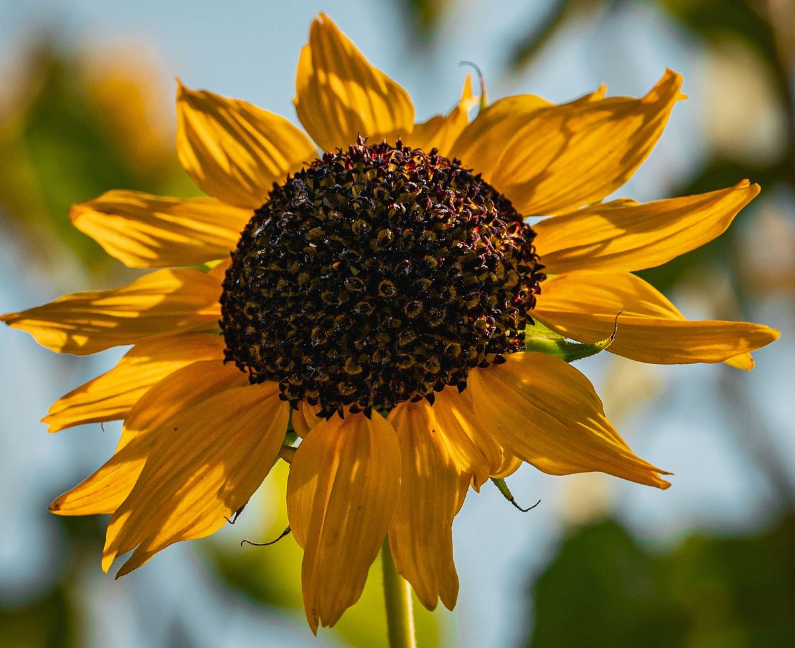

# ascii-art

Script-safe image to ASCII/Unicode art, in Python with Pillow as its only
runtime dependency.

Built against the design in the project's scout report (§6.1 core behaviour,
§6.2 scope fence, §6.3 test contract). It exists because the incumbents each
fail on a different axis: `chafa` chooses a pixel-graphics protocol from
environment variables and writes megabytes of escapes into a redirect,
`ascii-image-converter` exits 0 on a missing file and puts the error on stdout,
and no tool in the field publishes how its character ramp was ordered.

What this one does differently:

* **Transparent pixels are no ink.** A transparent-background PNG renders as
  art, not as a solid coloured box. Only `chafa` does this today.
* **Plain text whenever stdout is not a TTY**, always. No kitty/sixel/iTerm
  protocol is emitted under any circumstances. Errors go to stderr with exit
  code 2; usage errors exit 1.
* **A measured ramp.** The default glyph order comes from rasterising each
  glyph and measuring its actual ink coverage, not from a hard-coded string, and
  the same measurements set the quantisation thresholds. On the report's photo
  probe that is worth 2.4x in structural error and 2.4x in best-fit error over
  the same glyph set in its given order (`RMSE_struct` 0.140 vs 0.338,
  `RMSE_fit` 9.7 vs 23.1).
* **Dithering as a first-class mode.** The single biggest quality lever in
  monochrome: 76% better structure on a photograph, and 3x better raw error on
  text than the best incumbent.
* **Six pre-processing filters** in the CLI, which among the incumbents only
  `img2txt` partly has.

## Install

Python 3.10+ and Pillow. A project-local virtual environment is enough; nothing
is installed system-wide.

```console
$ python3 -m venv .venv
$ .venv/bin/pip install -e .
$ .venv/bin/ascii-art --help
```

Or without installing, from a checkout:

```console
$ .venv/bin/python -m ascii_art --help
```

## Use

```console
$ ascii-art logo.png                          # 80 columns, plain text on a pipe
$ ascii-art --width 100 photo.jpg              # 100 cells wide, aspect preserved
$ ascii-art --mode braille --dither diffusion screenshot.png
$ ascii-art --background light --chars "@%#*+=-:. " notes.png
$ ascii-art --mode block --color 256 --fg-only shot.png | less -R
$ cat icon.png | ascii-art --size 40x20 --format ansi --color truecolor
$ ascii-art --format html --output art.html photo.jpg
$ ascii-art --formats                         # what this build can decode
```

Library use is the same pipeline:

```python
from ascii_art import RenderOptions, load_image, render, to_text

canvas = render(load_image("logo.png"), RenderOptions(width=80, dither="ordered"))
print(to_text(canvas))
```

## Example

The input, `examples/sunflower.jpg` — a crop of a Pexels sunflower photo,
downscaled to 1200 px on its long edge so the repository stays small:



At 60 columns a whole photo is mostly texture, so the framing is the flower
itself and a compact ten-glyph ramp keeps the shape readable:

```console
$ .venv/bin/ascii-art examples/sunflower.jpg --width 60 --chars " .:-=+*#%@"
```

```text
#############################*+=+*######**+********=::::::+*
#*****#################*+*####****####**+*########**+===:::+
#*+==***###############**++*###**#####**##%###########***+:=
**+===+****##****#####*+**#***##############*******######*=:
*+=:::==+***##******##*++*+*#**#****+*************########*=
+++===::==***#**##****#*++=====************###***###******+:
+**++==::===+**+******=:--::-::::::=+*****###***##**=:::=::-
=++++******+*******+:-:-------::::=::::+***********+*****+++
*+****####******##+:--.--..-.-.----::==:***###*****###*=****
******++*##*+++**=.-...-........-.-::::-+******##***====****
#####******##***+....-....-..-....-..-:::**####**+=++**=+***
#**++++*****+++*+..................---:-+*********###**++***
####*+*+**++++===..-..............-.:-:=**++=*+==+++********
####***######***+:--......-.....-..:::+*+++*####********####
#####**####***+==++==-........--:=:+*+++++++*########****###
#####********+++++=====+:==:+++=*******++===+*#########**###
#########**++++++++=+=+++*+=**++*#*******++++**##%%%%%##***#
#####****#*+++***+=+*#+*+**+**++++*****###********#%%%%##***
##****###*==+**#*+*###***+++++++++*#####################**+=
##*+=:::**=+***######**++++==+++=+####%###*+===**##*****+=::
##**=:=+*+=*##**+******+++==+=*++=######*+::::::=++==:::::::
***=:=*****####*+=:=+**====**=**+=*####*=:::::::=:===::::::-
:::::=**##****##***++**===***=*****####*::::::::::::::::::::
:::::=**###****######********=*#*#####*+:::::::::::::==:::::
```

Rerun that command against the committed file to reproduce the block above.
The ramp was measured with JetBrainsMono Nerd Font, so another installed
monospace font can put different glyphs in the cells. The crop is baked into
`examples/sunflower.jpg`, because the tool has no crop flag.
Photo: Pexels, photo 31284696 (pexels.com) — free to use and redistribute.

## The option surface

| group | options |
|---|---|
| input | local paths, `-` or no argument for stdin, multiple files, `--formats` |
| mode | `--mode ramp\|braille\|block\|half\|edges`, `--chars`, `--ramp measured\|as-given`, `--edge-threshold` |
| tone | `--color none\|2\|8\|16\|256\|truecolor\|auto`, `--dither none\|ordered\|diffusion\|noise`, `--seed`, `--background dark\|light\|auto`, `--invert`, `--fg-only` |
| alpha | `--alpha transparent\|composite`, `--alpha-bg`, `--alpha-threshold` |
| geometry | `--width`, `--height`, `--size WxH`, `--scale N\|max`, `--fit`, `--stretch`, `--font-ratio W/H` |
| filters | `--brightness`, `--contrast`, `--gamma`, `--rotate`, `--flip-x`, `--flip-y` |
| output | `--output FILE`, `--format text\|ansi\|html`, `--polite` |

`--help` documents each one, including the mode table and the exit codes.

### Modes

| mode | what it is | when to use it |
|---|---|---|
| `ramp` (default) | ordered luminance ramp, 70 glyphs by default | photographs, general use |
| `braille` | `U+2800..U+28FF`, a 2x4 dot matrix per cell | detail; square sample points |
| `block` | `▀▄█` plus quadrants, five tone levels per cell | best monochrome tone; diagrams |
| `half` | `▀` carrying two colour samples per cell | colour only; refused with `--color none`, because monochrome half blocks are measurably broken |
| `edges` | Sobel edges drawn as `- \| / \` | line art, not photographs — hence off by default |

### Behaviour worth knowing

* `--color auto` resolves to `none` unless stdout is a terminal, and only ever
  upgrades on a TTY. `--output FILE` counts as a pipe. `--format html` assumes
  truecolour, because a colourless HTML file is useless.
* `NO_COLOR` disables colour unless you pass `--color` explicitly.
* **A colour depth never changes which glyphs are drawn** — it only changes
  escapes. `--color 2` is two colours: the terminal background, plus one forced
  ink colour (white for `--background dark`, black for light), with tone carried
  by the measured ramp exactly as it is with `--color none`. This is asserted
  across every mode and depth, because the alternative — giving a colour depth
  its own quantiser — silently deletes art: a one-bit `--color 2` thresholded at
  mid-grey and rendered a flat-colour logo on black as an empty canvas.
* **No mode draws an empty canvas for content that exists.** A fixed threshold
  is not a valid quantiser for an arbitrary image: content whose tonal band sits
  wholly on one side of it collapses to nothing. So when a mode's quantiser
  would return an all-blank or all-saturated canvas for non-uniform content, the
  valid range is re-mapped across that quantiser's range and the render is
  retried. Ordinary images are untouched — a flat colour still renders flat and
  a checkerboard still renders uniform — so no measured result changes.
* Downsampling is always an area average (a box filter over each cell's source
  rectangle). This is the single highest-leverage correctness fix over the
  incumbents, and it is why a fine checkerboard renders as flat grey instead of
  as a moiré pattern.
* `--font-ratio` (default `1/2`) is the aspect correction. It is a parameter
  because a terminal cell is about twice as tall as it is wide, and hard-coding
  that is what makes circles round in some tools and squashed in others.
* Output is deterministic. `--dither noise` is only random with `--seed`, and
  even then it is reproducible from the seed.

## Development

```console
$ .venv/bin/pip install -e . pytest
$ .venv/bin/python -m pytest                  # behaviour, render and quality suites
$ .venv/bin/python -m pytest -m quality       # just the section 6.3 regression suite
```

The quality suite scores rendered output with the metric from the report's
section 7.1 (`ascii_art.quality`): rasterise the glyph grid, box-downscale it
back to the cell grid, and compare against the source. It reports `RMSE`,
`RMSE_struct` (mean and contrast removed, isolating structure) and `RMSE_fit`
(after a best-fit brightness/contrast match, the fairest single number).

`tests/baselines.json` holds this implementation's own measurements of its own
deterministic fixtures; regenerate with:

```console
$ .venv/bin/python qual/make_baselines.py
```

To compare against the real incumbents, see `qual/`:

```console
$ .venv/bin/python qual/make_fixtures.py
$ ASCII_ART_INCUMBENT_PATH=/path/to/bin .venv/bin/python qual/metric.py --incumbents qual/images/photo.png
$ .venv/bin/python qual/figures.py --fixture photo     # then actually look at it
```

`qual/RESULTS.md` records the measured head-to-head, including the two probes
where an incumbent still wins.

### Layout

```
src/ascii_art/
  cli.py        argument parsing, pipe rules, exit codes (thin shell)
  render.py     the pipeline: alpha, geometry, modes, colour
  ramp.py       measured glyph ordering and thresholds
  dither.py     one quantiser, four dither modes, used by every mode
  palette.py    ANSI/xterm palettes, colour quantisation, depth resolution
  filters.py    the six pre-processing filters
  geometry.py   sizing and the aspect correction
  loader.py     paths, stdin, EXIF orientation, format reporting
  output.py     text, ANSI, HTML
  web.py        browser front end (HTTP) over the renderer
  quality.py    the section 7.1 metric
  fonts.py      monospace font discovery and ink-coverage measurement
tests/          behaviour, render, web and quality suites plus fixtures
qual/           metric runner, report-methodology cross-check, figures, results
```

## Run the web app (Docker)

`ascii_art.web` puts a browser interface on the renderer: upload an image,
set the same parameters the CLI takes (same names and defaults), render, then
copy or download the result.  Uploads are decoded and rendered in memory —
nothing is written to disk or sent anywhere — and the request body is
size-capped.

Build and start:

```console
$ docker compose up --build -d
```

Open http://localhost:8080.  The service listens on port **8080** inside the
container, mapped to host port 8080 by `docker-compose.yml`.

Stop it:

```console
$ docker compose down
```

Without compose:

```console
$ docker build -t ascii-art-web .
$ docker run --rm -p 8080:8080 ascii-art-web
```

Configuration is via environment variables (all optional):

| variable | default | meaning |
|---|---|---|
| `ASCII_ART_HOST` | `0.0.0.0` | address to bind |
| `ASCII_ART_PORT` | `8080` | port to listen on |
| `ASCII_ART_MAX_BODY_BYTES` | `20971520` (20 MiB) | upload cap; over-size bodies get `413` |
| `ASCII_ART_MAX_PIXELS` | `40000000` | decoded pixel cap; larger images get `413` |

There are **no volumes** — the service is stateless and keeps uploads in
memory, so it sits alongside other services on a host as a single
port-mapped container.  Put it behind a reverse proxy, or map a different host
port (`"127.0.0.1:8081:8080"`) to avoid a clash; nothing is shared between
replicas.  `GET /healthz` returns `ok` for health checks.

The image runs as an unprivileged user (`ascii`, uid 10001), builds from
`python:3.12-slim`, and keeps all build tooling in a throwaway build stage.

- Startup command (measured): `python -m ascii_art.web`, which prints
  `ascii-art-web: listening on http://0.0.0.0:8080 (max upload 20971520 bytes, max 40000000 pixels)`.
- Image size: **not yet measured** — the Dockerfile/compose file have not been
  built in this working environment (no Docker daemon), so the container is
  currently untested.  After the first build, record `docker images ascii-art-web` here.

## Not in this version

Deliberately, per the confirmed scope fence. No animation, video or webcam (GIF
contributes its first frame); no kitty/sixel/iTerm passthrough; no interactive
TUI; no structural glyph matching or custom font rasterisation; no neural
generation; no ASCII-to-image; no packaging beyond a working local build.
